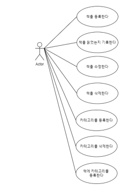

# 1. 프로젝트 목적
- 책 관리 앱
- 책을 등록하고 읽었는지 읽지 않았는지 기록

 

# 2. 목표
- [x] 책 등록: Form 요청 방식
- [x] 책 수정: Form 요청 방식
- [ ] 책 삭제: Form 요청 방식
- [ ] 책 등록: API 요청
- [ ] 책 수정: API 요청
- [ ] 책 삭제: API 요청
- [ ] 스프링부트 프로필관리: 개발, 배포
- [ ] 컨테이너화
- [ ] CI
- [ ] 로그인
- [ ] 세션관리

 

# 3. 요구사항
- [x] 사용자는 책을 등록할 수 있어야 한다.
- [x] 사용자는 책을 읽었는지 안읽었는지 선택할 수 있어야 한다.

 

# 4. 기술
- Springboot
- thymeleaf
- JPA
- Docker
- Jenkins
- Cloud

 

# 5. 설계
## 5.1 클래스 다이어그램
 

 

## 5.2 유즈 케이스 다이어그램
