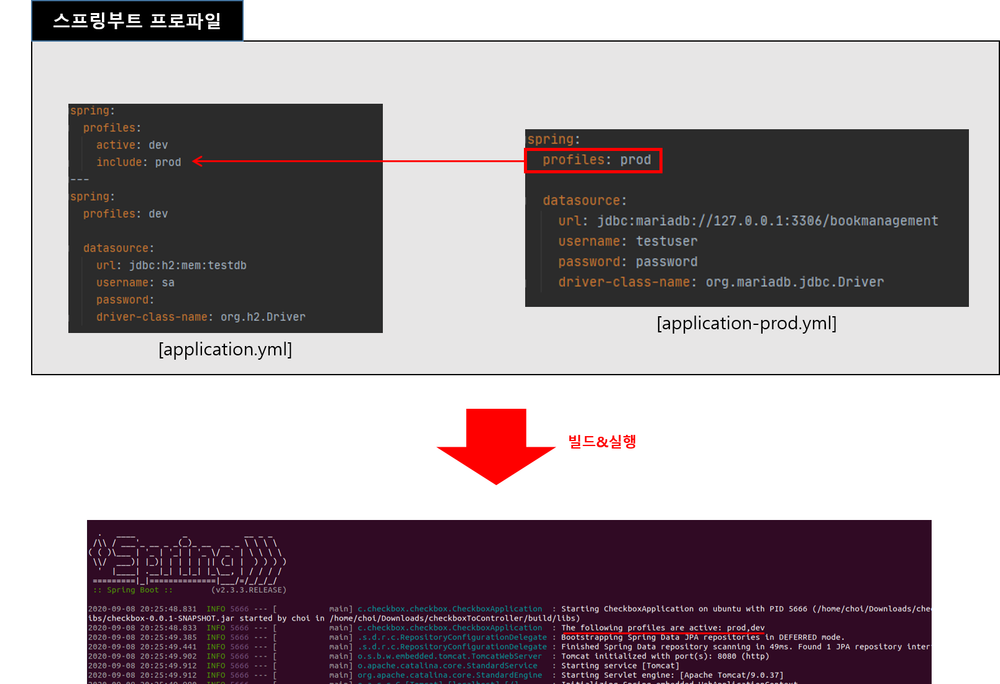

# build.gradle 수정
* gradle명령어를 사용할 때 인자를 받을 수 있도록 설정 -> 받을 인자: spring.profiles.active
> spring.profiles.active는 스프링부트에서 공식지원하는 환경변수 
```
String activeProfile = System.properties['spring.profiles.active']
systemProperty "spring.profiles.active", activeProfile
```

<br>

# 빌드
* application-prod.yml파일 생성
* gradle명령어를 사용할 때 -D인자로 환경변수를 전달
```
gradlew -Dspring.profiles.active=prod clean build
```

# 빌드된 파일에서 프로파일 선택
* profiles.include로 프로파일을 포함시켰을 경우 빌드 될 때 같이 올라감


<br>

* 프로파일 선택 명령어: --spring.profiles.active=[프로파일 경로]
```
java -jar builded.jar --spring.profiles.active=../../src/main/resources/application-prod.yaml
```

# 참고자료
* [1] 블로그: https://lejewk.github.io/springboot-gradle-spring-profiles-active/
* [2] 스택오버플로우 번역: https://cnpnote.tistory.com/entry/SPRING-%EC%8B%9C%EC%8A%A4%ED%85%9C-%EC%86%8D%EC%84%B1%EC%9D%84-Gradle-%EC%9E%91%EC%97%85%EC%97%90-%EC%A0%84%EB%8B%AC%ED%95%98%EB%8A%94-%EB%B0%A9%EB%B2%95
* [3] 영상: https://www.youtube.com/watch?v=P91tqdWUHE4